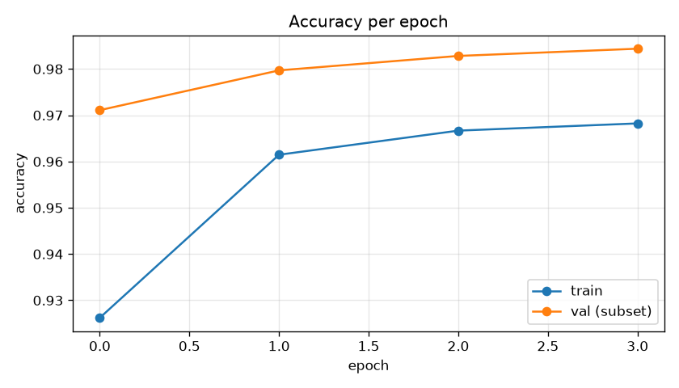
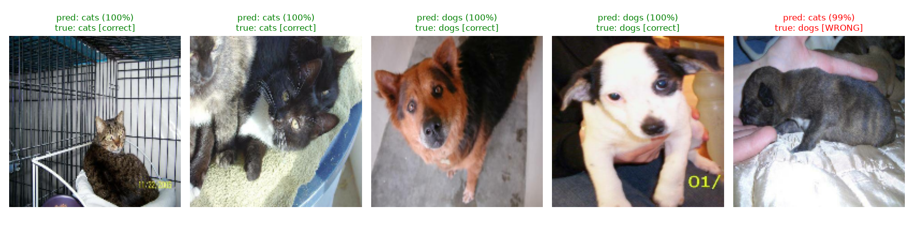

# Task 3 — Training Results

- Model: MobileNetV2 (frozen ImageNet base) + GAP + dropout + 1 sigmoid unit
- Trained on ~5760 images, 4 epochs, on CPU
- **Final training accuracy:** 0.968
- **Validation accuracy (full 5,000-image test set):** 0.980

## Example predictions

The misclassified example was predicted **cats** at 99% confidence when it was actually a **dogs**. The confidence is high — a *confidently wrong* prediction. Likely cause: the subject is presented in a way that matches the other class's typical photos — e.g. a small, dark, curled-up puppy cradled in a hand on a soft blanket looks a lot like how cats are usually pictured, and the dog-defining cues (long snout, body shape, upright ears) are hidden. Transfer-learned features latch onto that overall pose/context, so a cat-like presentation fools them.
